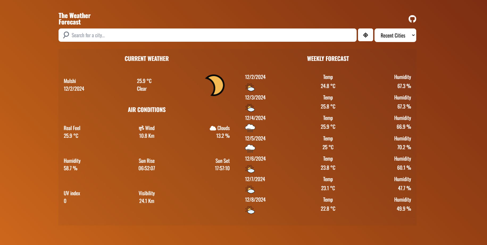

# 🌤️ Weather App

A dynamic and responsive weather application built with JavaScript and Tailwind CSS that provides weather data based on the user's location or a searched city. It leverages APIs to fetch real-time weather information and displays it in an intuitive interface.

### Website Live Link - ([Click Here](https://weather-forecast-internshala.netlify.app/))

### Github Link - ([Click Here](https://github.com/Aditya-Deshmukh9/weather-forecast-webapp-javascript))



---

## Features

- Fetches weather data based on the user's current location.
- Displays detailed weather information, including:
  - Current temperature.
  - Air conditions (wind speed, humidity, visibility, etc.).
  - Hourly forecasts with icons and descriptions.
- Search for weather data by city name.
- Error handling for location permissions and API failures.
- Responsive design for all devices.

---

## Tech Stack

- **Frontend**: HTML, Tailwind CSS, JavaScript
- **APIs**:
  - [Visual Crossing Weather API](https://www.visualcrossing.com/weather-api)
  - [Nominatim OpenStreetMap API](https://nominatim.org/)

---

## Installation

1. **Clone the Repository**:
   ```bash
   git clone https://github.com/your-username/weather-app.git
   cd weather-app
   ```
